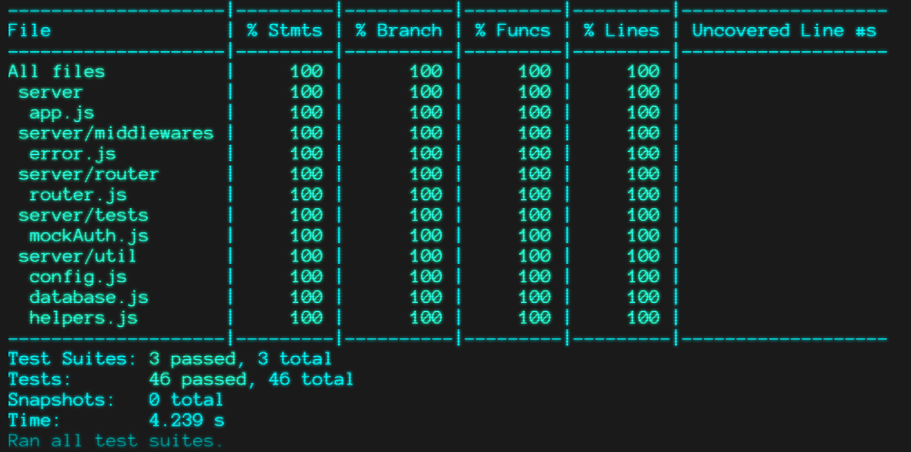
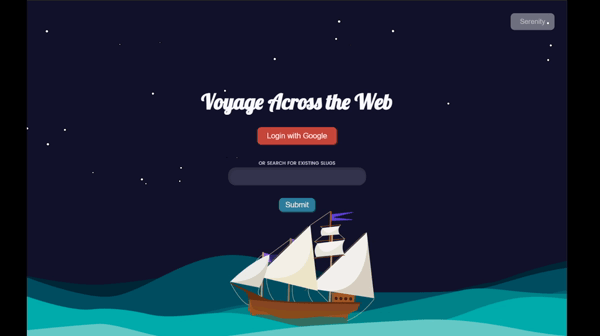
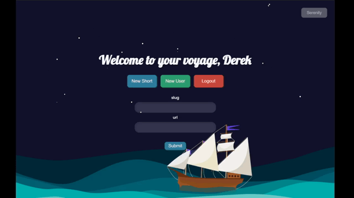
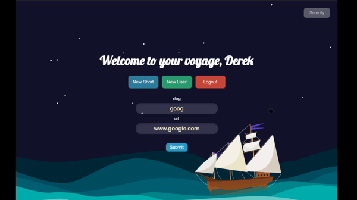

    
  
  <h1 align="center">
    Voyager - a full stack url shortener
     
  </h1>      

  

  A simple url shortener application with a Svelte and p5 front-end that you can stare at for hours. The post endpoints are protected by Google's OAuth, but anyone can access already created slugs.
     
  

  

   <strong>CSS</strong>&nbsp;  &nbsp; &nbsp; <strong>Vanilla</strong> &nbsp;  &nbsp; &nbsp;  <strong>Svelte</strong> &nbsp;  &nbsp; &nbsp; <strong>NodeJS</strong> &nbsp;  &nbsp; &nbsp; 
  

   
  

      
    
    
    
  

  

  
   
  refresh to see all 3 ship variations!
  

   
  
   
  Very proud to now include 100% Test Coverage with 100% passing tests

 

## Table of Contents
- [Table of Contents](#table-of-contents)
- [Installation](#installation)
  - [Requirements](#requirements)
  - [Steps](#steps)
- [Features](#features)
- [Upcoming Features](#upcoming-features)
- [FAQ](#faq)
  - [I mostly like what you've done, but I want to tweak a few things. Can I fork this and use it myself?](#i-mostly-like-what-youve-done-but-i-want-to-tweak-a-few-things-can-i-fork-this-and-use-it-myself)

## Installation

### Requirements

- A Mongo DB
> Here are a few options for your mongo DB. You can either run it locally on your system by installing it from [mongodb](https://www.mongodb.com/), spin up a docker container from [docker](https://hub.docker.com/_/mongo/), or have some cloud mongo service such as [atlas](https://www.mongodb.com/cloud/atlas).

- A Google Developer API
> This is perhaps a bit more complicated, but if you work through the google documentation [here](https://support.google.com/googleapi/answer/6158849?hl=en&ref_topic=7013279) then you will finish with a google client ID, google client secret. Use `[YOUR SERVER DOMAIN HERE]/oauth/google/callback` for your callback url. 

- A secure Cookie Key
> I won't get into choosing how to generate your cookie key here, as there is a lot of easily accessible information. Just make sure that this is not an easily guessed word/key, because it could allow complete access to unauthorized users if they have this.

- A static site host
> You can either self-host the static files or use one of the many CDN/other services that allow you to host these static files. I find that utilizing the global network that these organizations have allows greater speed from anywhere in the world.
 
### Steps

1) Fill out the `.env-sample` with all the relevant data, rename it to `.env` and run the server. There is also an included docker package if you prefer to containerize it.

2) Run the static files on your host.

3) You will need to seed your mongoDB with an initial user. If you don't know your Google ID then perhaps the easiest way to find it is utilize the failedRequests collection. Try and connect to your server(fail because you aren't authorized yet) and then transfer that information over to your users collection.

4) Enjoy the show!
   
## Features

- Beautiful front end that promotes zen-like travelling of the internet
- Google oAuth for all requests which add information to the database
- Continuous Integration and Deployment with Github Actions and Docker images
- Serenity mode. Hide the UI to use it as a screensaver!
   
  
- New Slug UI
   
  
- New User UI
   
  

## Upcoming Features

- A completed version 2 of the user interface finished in Svelte.
- A way to seed your database with an initial admin user.

## FAQ

### I mostly like what you've done, but I want to tweak a few things. Can I fork this and use it myself?

> Of course you can! I initially made this tool primarily for myself, but have released it to the wild to help anyone. Take it, change it, morph it and squash it to your heart's desire. 
